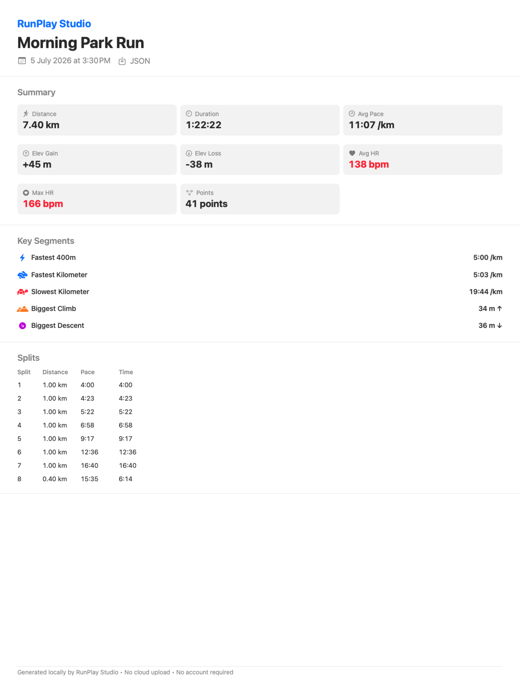

# RunPlay Studio

A native macOS post-run visualization studio for completed runs.

## What It Is

RunPlay Studio is a local-first desktop replay studio for GPS running workouts. Import completed runs from GPX, TCX, FIT, or JSON files and explore them with 3D route replay, synchronized charts, split analysis, and segment highlights.



At a glance:

- Native macOS SwiftUI app for completed-run analysis
- 3D SceneKit route replay with synchronized timeline controls
- Pace, elevation, and heart-rate coloring
- Automatic split analysis and segment highlighting
- Route comparison with summary deltas, splits, pace chart, 2D overlay, and 3D overlay
- Local JSON, CSV, and PNG exports
- Local-only privacy model: no account, no cloud, no telemetry, no AI API

## What It Is NOT

- A live run tracker
- A Strava clone
- A social network
- A generic fitness dashboard
- A web app
- An AI product

## Current Status

**✅ Verified Launchable** — Swift Package builds, tests pass, app launches with sample data.

| Check | Status |
|-------|--------|
| `swift package describe` | ✅ Pass |
| `swift build` | ✅ Pass |
| `swift test` | ✅ Pass (235 tests) |
| CI | ✅ GitHub Actions macOS workflow |
| Xcode launch | ✅ Opens via `open Package.swift` |
| Sample data loads | ✅ Two bundled JSON demo runs auto-load |
| JSON import | ✅ Tested with bundled fixture |
| GPX import | ✅ Tested with synthetic fixture |
| TCX import | ✅ Tested with synthetic fixture and manual local import |
| FIT import | ✅ Basic activity fixture covered |

## Build Requirements

- macOS 14.0+
- Xcode 15.0+ (for SwiftUI features)
- Swift 5.9+

## How to Build

This is a **Swift Package** (no `.xcodeproj` file). Xcode can open Swift Packages directly.

### Command Line

```bash
# Clone the repo
git clone https://github.com/shenghaoc/runplay-studio.git
cd runplay-studio

# Build
swift build

# Run tests
swift test
```

### Xcode

```bash
# Open the package in Xcode
open Package.swift
```

Xcode will open the Swift Package and resolve dependencies. To run:
1. Select the **RunPlayStudio** scheme in the toolbar
2. Choose **My Mac** as the destination
3. Press **⌘R** to build and run

The app will launch with two bundled sample runs pre-loaded so comparison mode can be tried immediately. Import additional runs via the sidebar import button (supports JSON, GPX, TCX, and FIT files).

### Xcode vs Swift Package

| Approach | Use Case |
|----------|----------|
| `open Package.swift` | Development, UI work, debugging |
| `swift build` / `swift test` | CI, headless verification, scripting |

Both approaches use the same source code. There is no separate Xcode project file to maintain.

## Supported Import Formats

| Format | Status | Notes |
|--------|--------|-------|
| JSON   | ✅ Full support | Native format, all fields supported |
| GPX    | ✅ Full support | Trackpoints with lat/lon/elevation/time; HR/cadence via extensions |
| TCX    | ✅ Full support | Training Center XML with laps, HR, cadence, distance |
| FIT    | ✅ Basic support | Binary format with GPS, altitude, HR, cadence; CRC not validated |
| HealthKit | 📋 Research only | Requires entitlements, future work |

## App Features

### 3D Route Visualization (SceneKit)

The 3D view is RunPlay Studio's main differentiator. It renders your run as an explorable 3D scene.

**What you see:**
- Route rendered as connected tubes showing your path
- Start marker (green sphere with "START" label)
- Finish marker (red sphere with "FINISH" label)
- Current position marker (yellow cone pointing in direction of travel)
- Kilometer markers (orange poles with distance labels)
- Adaptive ground grid for spatial reference

**Controls:**
- **Orbit** — Click and drag to rotate view
- **Zoom** — Scroll wheel or pinch to zoom in/out
- **Fit Route** — Button to see entire route at once
- **Camera presets** — Default, top-down, and side views
- **Elevation scale** — Choose 1x, 2x, 5x, or 10x exaggeration
- **Color mode** — Single color, pace-based, or elevation-based
- **Toggle grid** — Show/hide ground grid
- **Toggle km markers** — Show/hide kilometer markers

**Pace coloring:**
When pace coloring is enabled, the route shows fast sections in blue/cyan and slow sections in red/yellow. A legend displays the pace range. The color scale uses quantile-based normalization (10th/90th percentile) to avoid outliers, with moving average smoothing to reduce noise.

**Elevation coloring:**
When elevation coloring is enabled, low elevations are green and high elevations are brown/orange.

**Elevation handling:**
Routes with elevation changes are visualized with configurable exaggeration:
- 1x — True scale (may look flat for gentle hills)
- 2x — Default, good balance for most routes
- 5x — Makes moderate hills visible
- 10x — For very flat routes where you want to see any elevation

### Map View (MapKit)
- 2D overhead route display
- Start/finish annotations
- Reference context for the 3D view

### Charts (Swift Charts)
- Pace, elevation, heart rate over time
- Interactive scrubbing synced to replay

### Split Analysis
- Automatic kilometer splits
- Per-split pace, elevation gain, heart rate
- Fastest/slowest segment highlighting
- Current split highlighted during replay

### Synchronized Replay
All views stay in sync with the replay position:
- 3D route marker updates with timeline
- 2D map marker matches selected position
- Charts show selection indicator at current distance
- **Chart click/drag to seek** — drag on charts to navigate the run
- Current metrics panel shows real-time data
- Split table highlights current split
- Timeline slider drives all views

Chart drag behavior: dragging on any chart pauses playback and seeks to the selected position. Visual feedback shows an orange indicator during drag.

### Segment Detection
Automatically identifies key run segments:
- Fastest 400m
- Fastest 1km
- Slowest 1km
- Biggest climb
- Biggest descent

Segments are detected using distance-based sliding windows for accuracy with uneven GPS sampling. Selecting a segment highlights it in 3D and seeks the replay to its start.

### Export
Export workout data as local files:
- **JSON Summary** — Complete workout data with splits and segments
- **Splits CSV** — Kilometer splits with pace, elevation, heart rate
- **Segments CSV** — Detected segments with metrics
- **Combined CSV** — Splits and segments in one file
- **PNG Summary Card** — Polished stats card image (1200×1600)

All exports are local-only. No data is uploaded anywhere.
PNG export renders a SwiftUI card using NSHostingView (requires GUI context).
The README demo image is generated from bundled synthetic data.

### Route Comparison
Compare two completed runs:
- Summary metric deltas (distance, duration, pace, elevation)
- Average and max heart-rate deltas when both runs contain heart-rate data
- Per-split comparison with winner indication
- Pace over distance comparison chart
- 2D map overlay with both routes and a simple legend
- 3D comparison overlay with both routes in the same scene
- Warnings for different distances, route shapes, insufficient overlap, and missing data
- Distance-based alignment (no route matching)

**3D comparison**: Both routes are projected into a shared coordinate space so they
maintain correct relative positioning. Primary route is blue, comparison route is
orange. Each route has distinct start/finish markers. Controls include elevation
exaggeration, camera presets, fit-to-routes, and grid toggle.

Current limitations: comparison is distance-aligned only and does not do dynamic
time warping.

## Privacy

- **Local-only** — All data stays on your Mac
- **No cloud** — No external servers or sync
- **No analytics** — No usage tracking
- **No telemetry** — No phone-home behavior
- **No account** — No sign-up or login
- **No AI API** — No external AI services

For manual dogfooding with real workouts, keep private files in ignored local
paths and follow [docs/private-data.md](docs/private-data.md). Public fixtures
and demo assets must be synthetic or anonymized.

## Roadmap

See [docs/phase-plan.md](docs/phase-plan.md) for detailed development phases.

## License

MIT License — see [LICENSE](LICENSE)
